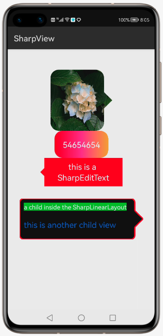

[](https://github.com/applibgroup/SharpView-Lib/actions/workflows/main.yml)
[](https://sonarcloud.io/dashboard?id=applibgroup_SharpView-Lib)

# SharpView

It is a HMOS Library which provides a Custom TextView,LinearLayout,RelativeLayout with sharpView

## Source
The code in this repository was inspired from [zengzhaoxing/SharpView - Release v2.4.7](https://github.com/zengzhaoxing/SharpView). 
We are very thankful to zengzhaoxing. 




## Directions

* custom properties

name | format | instructions
-----|------|------
radius    | dimension | corner radius size
backgroundColor   | color | Background color (be careful not to use HMPS native background-related attributes such as: background_element)
arrowDirection    | enum | SharpView relative position (top, left, right, bottom)
relativePosition   | fraction | Relative position of sharpview in fraction
sharpSize    | dimension | Sharpview size, 0 means no sharp corners are displayed, the default is 0
border    | dimension | Border size, default is 0
borderColor    | color | Border color
startBgColor    | color | Gradient initial color (required for gradient)
middleBgColor    | color | Gradient middle color (optional when gradient)
endBgColor    | color | Gradient end color (required for gradient)
    
Gradient colors are only valid when sharpSize is 0 (no sharp corners)

## Dependency
1. For using SharpView module in sample app, include the source code and add the below dependencies in entry/build.gradle to generate hap/support.har.
```groovy
	dependencies {
		implementation project(':sharpview')
        	implementation fileTree(dir: 'libs', include: ['*.har'])
        	testCompile 'junit:junit:4.12'
	}
```
2. For using SharpView in separate application using har file, add the har file in the entry/libs folder and add the dependencies in entry/build.gradle file.
```groovy
	dependencies {
		implementation fileTree(dir: 'libs', include: ['*.har'])
		testCompile 'junit:junit:4.12'
	}

```
3. For using SharpView from a remote repository in separate application, add the below dependencies in entry/build.gradle file.
```groovy
	dependencies {
		implementation 'dev.applibgroup:sharpview:1.0.0'
		testCompile 'junit:junit:4.12'
	}

```

## Usage

* 1.In the XML
```xml

  <com.zhaoxing.view.sharpview.SharpEditText
        ohos:width="match_content"
        ohos:height="match_content"
        ohos:left_margin="50vp"
        ohos:text_color="#FFFFFF"
        ohos:text="this is a SharpTextView"
        ohos:text_size="30vp"
        app:backgroundColor="#FFFF0000"
        app:arrowDirection="left"
        app:relativePosition="0.5"
        app:sharpSize="10vp"
        />
   
  <com.zhaoxing.view.sharpview.SharpLinearLayout
        ohos:width="700vp"
        ohos:height="200vp"
        ohos:orientation="vertical"
        ohos:margin="50vp"
        app:radius="10vp"
        app:arrowDirection="right"
        app:backgroundColor="#FF000000"
        app:relativePosition="0.9"
        app:sharpSize="15vp"
	/>

```

* 2.In the code
```java

SharpLinearLayout sharpLinearLayout = (SharpLinearLayout) findViewById(ResourceTable.Id_sharp_ll);
//get the SharpViewRenderProxy of the sharpView to refresh sharp）
sharpLinearLayout.getRenderProxy().setArrowDirection(SharpView.ArrowDirection.BOTTOM);
sharpLinearLayout.getRenderProxy().setSharpSize(50);
sharpLinearLayout.getRenderProxy().setRelativePosition(0.8f);
sharpLinearLayout.getRenderProxy().setRadius(20);
sharpLinearLayout.getRenderProxy().setBackgroundColor(0xff000000);

```


## Usage

```java
public class SharpEditText extends TextField
public class SharpTextView extends Text 
public class SharpLinearLayout extends DirectionalLayout
public class SharpRelativeLayout extends DependentLayout 
public class SharpImageView extends Image 
```

# Author 
name ： 曾宪梓<br/>
email ： 1071481464@qq.com

# License

Copyright 2017 zengzhaoxing


Licensed under the Apache License, Version 2.0 (the "License");
you may not use this file except in compliance with the License.
You may obtain a copy of the License at

   http://www.apache.org/licenses/LICENSE-2.0

Unless required by applicable law or agreed to in writing, software
distributed under the License is distributed on an "AS IS" BASIS,
WITHOUT WARRANTIES OR CONDITIONS OF ANY KIND, either express or implied.
See the License for the specific language governing permissions and
limitations under the License.
